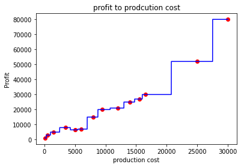

```python
import numpy as np
import matplotlib.pyplot as plt
import pandas as pd

```


```python
dataset = np.array(
[['Asset Flip', 100, 1000],
['Text Based', 500, 3000],
['Visual Novel', 1500, 5000],
['2D Pixel Art', 3500, 8000],
['2D Vector Art', 5000, 6500],
['Strategy', 6000, 7000],
['First Person Shooter', 8000, 15000],
['Simulator', 9500, 20000],
['Racing', 12000, 21000],
['RPG', 14000, 25000],
['Sandbox', 15500, 27000],
['Open-World', 16500, 30000],
['MMOFPS', 25000, 52000],
['MMORPG', 30000, 80000]
])
```


```python
print(dataset)

```

    [['Asset Flip' '100' '1000']
     ['Text Based' '500' '3000']
     ['Visual Novel' '1500' '5000']
     ['2D Pixel Art' '3500' '8000']
     ['2D Vector Art' '5000' '6500']
     ['Strategy' '6000' '7000']
     ['First Person Shooter' '8000' '15000']
     ['Simulator' '9500' '20000']
     ['Racing' '12000' '21000']
     ['RPG' '14000' '25000']
     ['Sandbox' '15500' '27000']
     ['Open-World' '16500' '30000']
     ['MMOFPS' '25000' '52000']
     ['MMORPG' '30000' '80000']]
    


```python
#select allthe rows and column 1
X=dataset[:,1:2].astype(int)
print(X)
```

    [[  100]
     [  500]
     [ 1500]
     [ 3500]
     [ 5000]
     [ 6000]
     [ 8000]
     [ 9500]
     [12000]
     [14000]
     [15500]
     [16500]
     [25000]
     [30000]]
    


```python
#select all the rows and column 2 from dataset 
y=dataset[:,2].astype(int)
print(y)
```

    [ 1000  3000  5000  8000  6500  7000 15000 20000 21000 25000 27000 30000
     52000 80000]
    


```python
#import DecisionTreeRegressor
from sklearn.tree import DecisionTreeRegressor
regressor=DecisionTreeRegressor()
regressor.fit(X,y)
```


    DecisionTreeRegressor()


```python
y_pred=regressor.predict([[3000]])
print("Predicted value: %d\n "% y_pred)
```

    Predicted value: 8000
     
    


```python
#visualization
X_grid=np.arange(min(X),max(X),0.01)
X_grid=X_grid.reshape((len(X_grid),1))
plt.scatter(X,y,color='red')
plt.plot(X_grid,regressor.predict(X_grid),color="blue")
plt.title("profit to prodcution cost")
plt.xlabel("production cost")
plt.ylabel("Profit")
plt.show()
```





```python
from sklearn.tree import export_graphviz
export_graphviz(regressor,out_file='tree.dot',feature_names=['Prodcution Coast'])
```


```python

```
